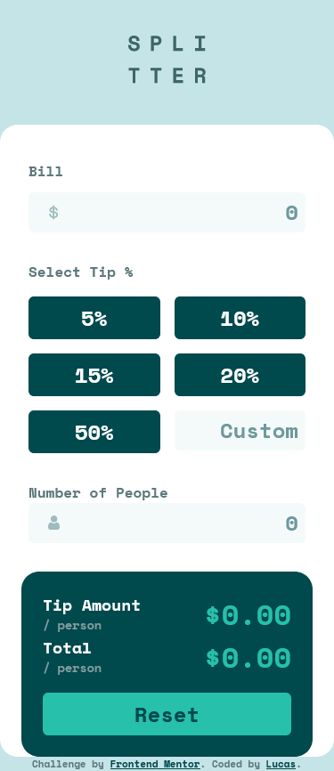
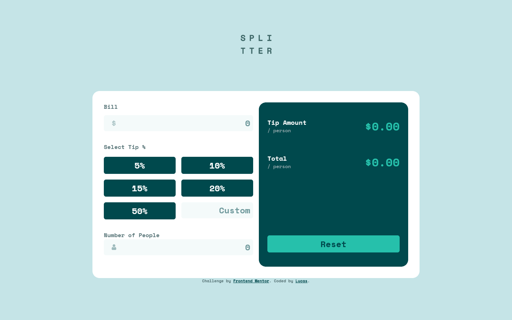

# Frontend Mentor - Tip calculator app solution

This is a solution to the [Tip calculator app challenge on Frontend Mentor](https://www.frontendmentor.io/challenges/tip-calculator-app-ugJNGbJUX). Frontend Mentor challenges help you improve your coding skills by building realistic projects.

## Table of contents

  - [The challenge](#the-challenge)
  - [Screenshot](#screenshot)
  - [Links](#links)
- [My process](#my-process)
  - [Built with](#built-with)
  - [What I learned](#what-i-learned)
  - [Useful resources](#useful-resources)
- [Author](#author)

## Overview

### The challenge

Users should be able to:

- View the optimal layout for the app depending on their device's screen size
- See hover states for all interactive elements on the page
- Calculate the correct tip and total cost of the bill per person

### Screenshot

# mobile

# desktop

### Links

- Solution URL: [GitHub](hhttps://github.com/lucas26a/tip-calculator-app)
- Live Site URL: [Netlify](https://ugly-tipcalculatorapp.netlify.app/)

## My process

### Built with

- Semantic HTML5 markup
- CSS custom properties
- Flexbox
- CSS Grid
- Mobile-first workflow

### What I learned

input, focusin, focusout and change events.

### Useful resources

- [input event](https://developer.mozilla.org/en-US/docs/Web/API/HTMLElement/input_event)

## Author

- Website - [GitHub](https://www.github.com/lucas26a)
- Frontend Mentor - [@lucas26a](https://www.frontendmentor.io/profile/lucas26a)
- Twitter - [@lucas26almeida](https://www.twitter.com/lucas26almeida)

